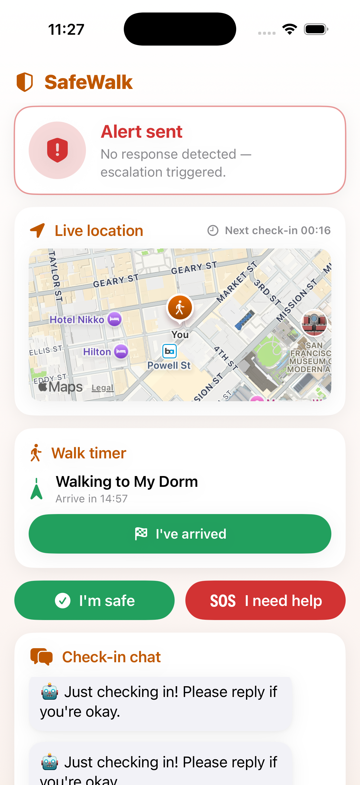
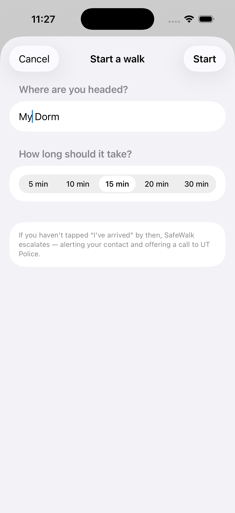
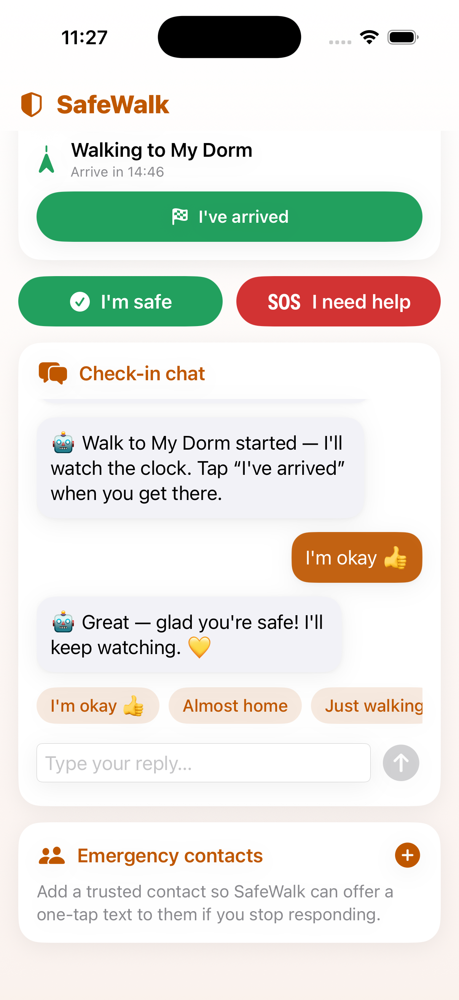
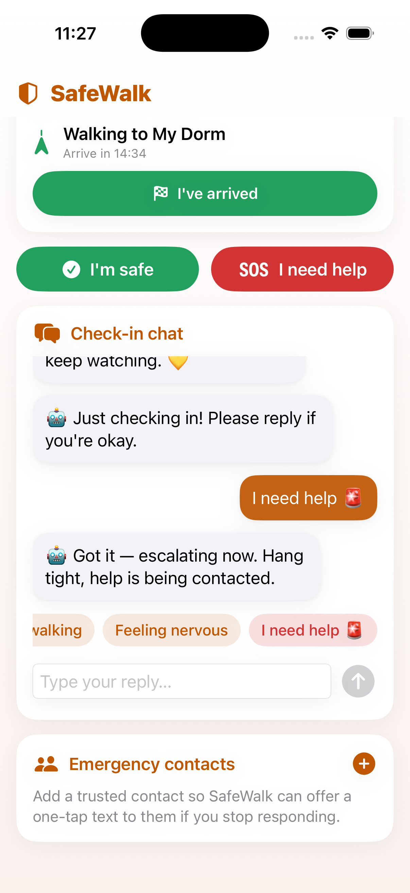
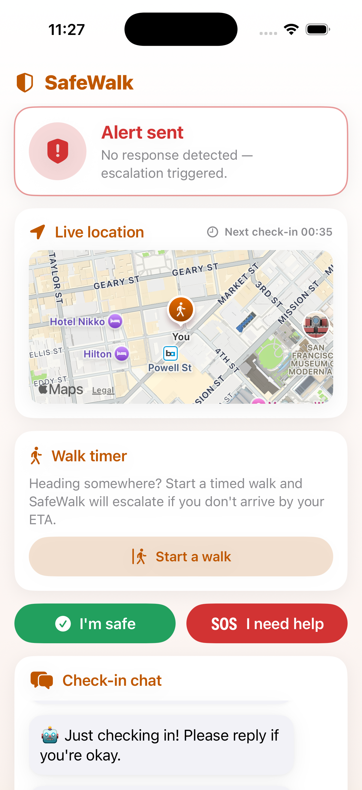

# SafeWalk

**Your AI companion for the walk home.**

SafeWalk is an iOS app that keeps an eye on you when you're walking alone — late at night, leaving a party, or crossing campus. An AI chatbot checks in with you at regular intervals; if you stop responding or stop moving, it raises an alert and gives you one tap to call campus police or text a trusted contact, so help is never more than a button away.

[](https://github.com/billdmar/SafeWalk/actions/workflows/ci.yml)


---

## Features

- **At-a-glance safety status** — A prominent, animated status hero communicates your state at a glance: **You're safe** (calm green), **Checking in…** (amber, while a prompt awaits your reply), or **Alert sent** (red) when escalation fires. The pulse animation respects the system **Reduce Motion** setting.
- **Walk timer / ETA** — Heading somewhere? Name your destination and how long the walk should take; SafeWalk counts down to your ETA and **auto-escalates if you don't tap "I've arrived" in time** — the same alert path as the inactivity watcher, anchored to a concrete deadline.
- **One-tap quick actions** — **I'm safe** instantly resets the check-in clock and reassures the companion; **I need help** triggers escalation immediately, without waiting for the inactivity timer. Automatic escalation fires a distinct error haptic so an alert is *felt*, not just seen.
- **AI check-in companion** — A friendly chatbot powered by Google Gemini messages you on a timer ("Just checking in! Reply if you're okay") and holds a natural, supportive conversation while you walk. Calls are **resilient**: a request timeout and one automatic retry on transient network/server failures, with typed errors so the app fails gracefully when offline.
- **One-tap AI quick replies** — A row of suggested replies ("I'm okay 👍", "Almost home", "Feeling nervous", "I need help 🚨") under the chat. Tapping one sends it to the Gemini AI companion, which replies with a real, context-aware message — and applies the right safety effect (confirm safety, or escalate). If the network or AI is unavailable, an instant built-in response is shown as a fallback so the chat always answers. The **"I need help"** reply is the one exception: it escalates *instantly* and never waits on the AI, because a safety action must not depend on the network.
- **Live location map** — A MapKit view tracks your position in real time using Core Location, with a live countdown to the next check-in.
- **Background tracking** — With "Always" location permission, SafeWalk keeps watching your position even when the screen is locked or the app is backgrounded (via the `location` background mode).
- **Inactivity & no-movement detection** — If you don't reply or you stop moving for too long, the app assumes something may be wrong and escalates automatically.
- **Multi-contact escalation** — Add and manage trusted contacts (persisted locally with `UserDefaults`). When escalation fires, the alert offers a one-tap "Text *n* contacts" action that opens a group SMS to **every** saved contact with a dialable number — prefilled with a help message and a Maps link to your last known location — alongside the campus-police call. One bad number can't suppress the texts to the others.
- **One-tap emergency escalation** — A push notification with a "Call UT Police" action dials campus police (512-471-4441) directly from the lock screen.
- **Accessibility** — VoiceOver labels throughout, Dynamic Type-friendly chat bubbles, Reduce Motion support, and haptics on escalation.

## How it works

| Mechanism | Detail |
| --- | --- |
| Check-in timer | Prompts you every 60 seconds; resets whenever you respond. |
| Inactivity threshold | No reply **or** no movement for 2 minutes triggers an alert. |
| Walk timer | Optional, opt-in: a destination + expected duration. Running past your ETA without tapping "I've arrived" escalates immediately (regardless of movement). |
| Movement detection | `CLLocationManager` flags movement when you travel more than 5 m. |
| Background tracking | Requests "Always" authorization and enables `allowsBackgroundLocationUpdates` (with the `location` background mode) so tracking continues when backgrounded/locked. |
| Escalation | Local notification with an actionable "Call UT Police" button (`tel://`), plus a "Text *n* contacts" button (group `sms:` with a prefilled help message + location) when emergency contacts are saved. |
| Decision logic | The escalation decision, movement rule, countdown formatting, walk-overrun rule, and SMS/`tel:` deep-link construction are pure, side-effect-free functions (`SafetyEngine`, `WalkSession`/`WalkTimer`, `Escalation`) with unit-test coverage. |

## Tech stack

| Area | Technology |
| --- | --- |
| UI | SwiftUI (iOS 18+) |
| Language | Swift 5 / Xcode |
| AI chat | Google Gemini (`gemini-2.0-flash`) |
| Location & maps | Core Location + MapKit |
| Notifications | UserNotifications (actionable categories) |
| Persistence | `UserDefaults` (Codable emergency contacts) |

## Screenshots



*The SafeWalk dashboard: live location map with a check-in countdown, an active walk timer
counting down to your ETA, one-tap **I'm safe** / **I need help** actions, and the check-in chat —
in SafeWalk's burnt-orange-and-white theme. Captured in the iOS Simulator (iPhone 17 Pro).*

| Walk timer setup | Quick replies — "I'm okay" | Quick replies — "I need help" |
| :--: | :--: | :--: |
|  |  |  |
| Name a destination and pick how long the walk should take — SafeWalk escalates if you don't arrive in time. | One-tap replies go to the Gemini AI companion: "I'm okay" confirms safety and the AI answers in context. | "I need help 🚨" posts a distress message and triggers escalation instantly — no AI round-trip. |

<p align="center">
  <br>
  <em>The <strong>Alert sent</strong> state after escalation — the status hero turns red, with the idle walk timer ready to start a new walk.</em>
</p>

## Architecture

See [docs/ARCHITECTURE.md](docs/ARCHITECTURE.md) for the full component diagram, runtime flow, and a note on what is verified by CI vs. what needs on-device testing.

- **`SafetyWatcherView`** — the main screen: live map, check-in countdown, walk-timer card, chat feed, and emergency-contacts panel.
- **`SafetyEngine`** — the pure decision core: escalation decision (no-response/no-movement vs. thresholds), the 5 m movement rule, and the `mm:ss` countdown formatter. No UI, no system calls — fully unit-tested.
- **`WalkSession` / `WalkTimer`** — the pure walk-timer model and overrun rule (`.onTrack` / `.escalateOverdue`), with time injected so it's deterministic and tested.
- **`Escalation`** — pure builders for the `sms:` / `tel:` deep links and the group-SMS recipient list, with phone-number normalization that fails safe on undialable input.
- **`GeminiManager`** — a singleton that wraps the Gemini REST API with `Codable` models, a request timeout, one retry on transient failures, and typed errors.
- **`LocationManager`** — an `ObservableObject` `CLLocationManagerDelegate` that publishes location updates, fires a movement callback, and escalates to "Always" authorization for background tracking.
- **`NotificationDelegate`** — a shared singleton that handles the actionable notification, placing the emergency call (`tel:`) or texting all saved contacts (group `sms:`).

See [docs/SECURITY-REVIEW.md](docs/SECURITY-REVIEW.md) for a security & privacy review (PII handling, key management, and the known escalation fail-safe gaps).

## Getting started

1. Clone the repo and open `Party Watcher.xcodeproj` in Xcode.
2. Get a Google Gemini API key from [Google AI Studio](https://aistudio.google.com/app/apikey).
3. Copy the secrets template and add your key:
   ```bash
   cp "Party Watcher/Secrets.example.swift" "Party Watcher/Secrets.swift"
   ```
   Then edit `Secrets.swift` and set `geminiAPIKey`. This file is gitignored and never committed.
4. Build and run on a device or simulator (location features work best on a real device).

## Notes

This project was built as a campus-safety prototype for the University of Texas at Austin; the emergency-call action is wired to UTPD. The escalation logic is a proof of concept and is **not** a substitute for emergency services — always call 911 in a real emergency.

## License

[MIT](LICENSE) © William Mar
